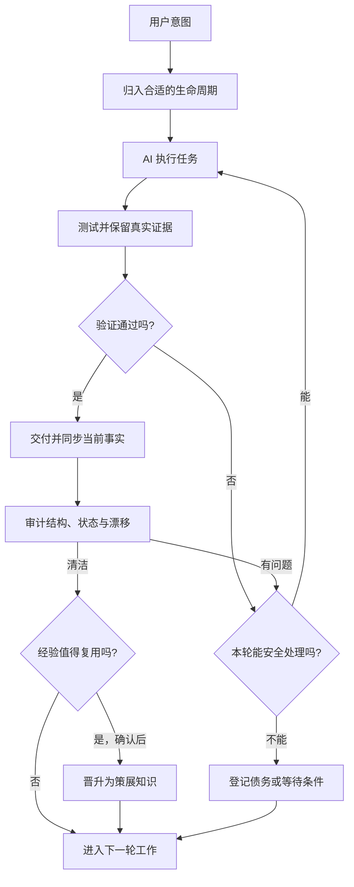
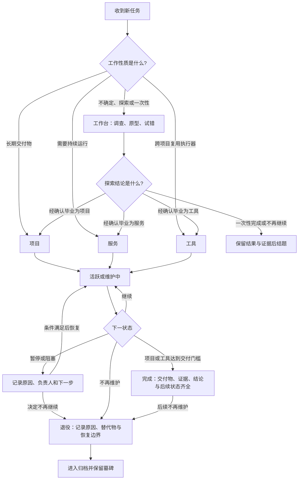
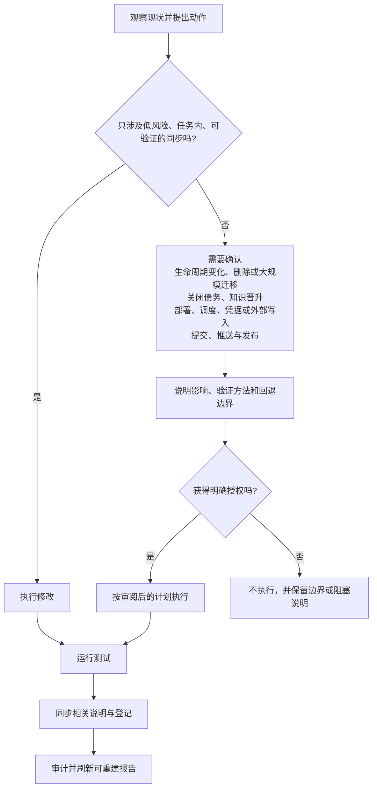
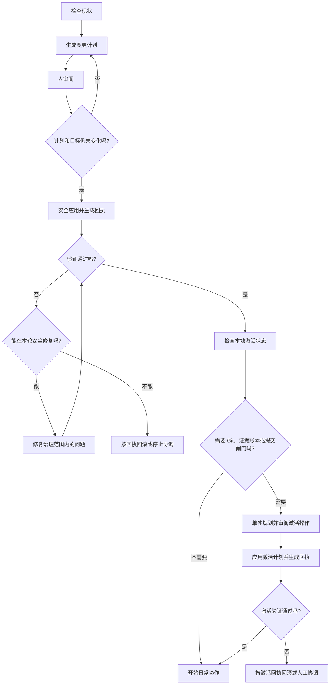

# AI Workspace Template

让 AI 不只会“帮你做一次”，还知道怎样和你一起把事情长期维护好。

这是一个面向真实工作的 AI 工作区模板。它适合软件项目、研究、内容生产、个人运营，以及任何会不断积累文件、决定、经验和自动化的长期事务。

很多工作区一开始都很轻松：先建几个文件夹，想到什么就让 AI 写什么。时间一长，问题才慢慢出现——草稿和正式成果混在一起，README 与实际状态对不上，失败过程找不到，自动化到底有没有运行也没人说得清。AI 越能干，混乱往往来得越快。

这个模板想解决的就是这件事：给人和 AI 一套简单、可检查的共同工作方式。

> 当前版本：`0.1.0-alpha.2`。已经可以用于新工作区和现有工作区的安全接管；公开契约仍可能在 `0.1.0` 前调整。

## 它会怎样改变你的工作方式

它不会要求 AI 记住所有事情，而是让重要信息在合适的阶段留下来：



你会得到几件很朴素、但很重要的东西：

- 新想法有临时落脚处，不会一开始就被包装成“正式项目”。
- 长期项目、常驻服务和复用工具有各自的责任与完成标准。
- AI 做过的测试、失败和关键决定都有证据可追，不靠聊天记忆。
- 文档、状态和实际文件会定期对账；发现漂移，就修复或明确记成有负责人、有期限的债务。
- 真正稳定的经验可以沉淀为知识，未经验证的模型输出不会悄悄变成事实。

## 一项工作从哪里开始，又到哪里结束

工作先按性质落位，不确定或一次性的事情先探索；确认值得长期维护后，再经人确认“毕业”为项目、服务或工具。这比一开始猜它应该是什么，更容易保持工作区干净。



完成和退役不是一回事：完成表示承诺已经交付，退役表示对象不再维护。暂停和阻塞也不会被当作失败，它们会保留原因、负责人和恢复条件。

在实际协作里，你不必手动维护所有表格。AI 会读取当前工作项、状态和最近证据，在完成任务的同时同步受影响的说明与登记信息；收尾前再跑一次审计，确认没有留下无人负责的问题。

## AI 自动维护到底会做什么

这里的“自动维护”不是让 AI 擅自整理整个硬盘，而是把维护分成清楚的边界：



这种设计的目标不是限制 AI，而是让它在可以放心行动的地方更主动，在会改变历史、外部系统或事实认定的地方停下来找你确认。

## 开始使用

最简单的方式，是点击 GitHub 的 **Use this template** 创建自己的仓库，然后把下面整段话交给编码 Agent。它不依赖某个产品的斜杠命令：只要 Agent 能读取本地文件、修改文件并执行终端命令，就能按仓库里的同一份 Skill 工作；只能聊天、不能操作文件的 AI 无法完成初始化。

### 复制这一段给 Agent

把“目标目录”替换成你的路径；如果仓库已经在 Agent 当前打开的目录里，保留“默认当前目录”即可。

```text
请把【目标目录，默认当前目录】初始化为可以长期由 Agent 维护的 AI 工作区。先完整读取目标中的 `AGENTS.md`（如存在），以及目标或当前模板仓库里的 `.agents/skills/bootstrap-ai-workspace/SKILL.md` 和其中要求的引用文件，再开始操作。如果该 Skill 不可访问，请停止并告诉我需要先打开或下载模板仓库，不要自行猜测替代流程。

请先根据真实文件判断入口：已经具备 `workspace.toml`、治理脚本和该 Skill 的模板副本，不要重复接管，只检查需要个性化的配置和本地激活状态；空目录使用 new；有业务文件但尚未治理的目录使用 adopt，并完整保留原有内容。

我授权你在“不删除、不移动、不覆盖原有业务文件，不操作凭据，不部署，不修改外部调度器，不提交或推送”的边界内，连续完成 inspect → plan → review → apply → verify；文件层验证通过后，再用独立的 activation plan/review/receipt 激活缺失的 Git、`.ai` 证据账本和 pre-commit hook。纯增量且没有需要我决定的风险时可以直接完成；只有遇到业务含义不明、目标漂移、验证失败无法安全修复，或需要超出上述边界时才停下来问我。

结束时请用普通人能看懂的语言说明：创建或修改了什么、保留了什么、真实验证结果、仍然未知的外部状态、回滚回执，以及“治理检查：同步 X；债务 Y”。
```

这是一段话启动，不是取消安全边界。它一次性授权纯增量初始化和本地激活，因此 Agent 不需要每一步都让你回复“继续”；移动、删除、覆盖、部署、凭据、外部调度器、提交和推送仍然必须另行确认。

接管已有目录时，最稳妥的方式是在本模板仓库中打开 Agent，再把目标的绝对路径填进提示词；这样 Agent 能读取 Skill，同时不会把模板源误当成你的业务目录。

它会按下面的过程工作：



这个流程既可以初始化一个新目录，也可以接管已经使用很久、甚至还有未提交修改的现有工作区。默认只做增量补充，不会把你的业务文件硬套进模板目录。Git、证据账本和提交闸门属于本地操作能力，需要在文件接管通过后单独规划和激活；验证失败时，优先修复本轮范围内的治理问题，只有不宜继续时才按回执回滚。

完成第一次接管后，日常使用并不复杂：

1. 把新任务交给 AI；不确定的工作先探索。
2. 让 AI 实现、测试，并保留关键证据和失败过程。
3. 达到长期维护条件时，经确认后再把工作毕业为项目、服务或工具。
4. 每轮结束运行工作区审计；问题当场修复，或登记为明确债务。
5. 定期巡检状态与知识原料，避免文档、现实和经验慢慢分叉。

## 适合哪些场景

- **软件研发**：管理原型、应用、在线服务、架构决定和故障经验。
- **科研与数据工作**：区分假设、试验、真实结果、失败方法和已验证结论。
- **内容生产**：串起选题、草稿、栏目、素材来源、发布流程与风格复盘。
- **个人运营**：维护长期目标、临时调查、提醒任务、订阅资产和决策经验。
- **多人或多 Agent 协作**：让不同参与者面对同一套状态、证据与权限边界。

领域可以不同，流程不必推倒重来。你只需要调整工作区名称、状态和领域规则，核心的生命周期与验证方式可以继续复用。

## 信息最终去了哪里

你不需要每天关心目录，但需要知道四类信息不会混在一起：

- **规则**说明什么可以做、什么必须确认。
- **当前事实**说明现在有哪些工作、由谁负责、处于什么状态。
- **证据**记录实际试过什么，包括失败、输出和关键决定。
- **知识**只保留经过验证、写明边界、以后还能复用的结论。

因此，聊天不是事实，测试日志也不会自动变成知识；每一次有价值的转化都保留来源。

更完整的信息流说明见 [Information Flow](docs/INFORMATION-FLOW.md)，设计理由见 [Governance Design](docs/GOVERNANCE.md)。

## 安全与隐私

- 本地 AI 证据、运行报告、原生会话、日志、数据库和凭据默认不进入公开仓库。
- 项目不包含遥测，也不会主动上传工作区内容。
- 看不见外部环境时只报告“未知”，不会把无法确认误写成成功或失败。
- 自动巡检默认只观察和生成可重建报告，不会自行删除、迁移、部署或修改外部系统。
- 公开证据需要先脱敏和人工审阅，不能直接上传完整会话或本地账本。

## 给维护者的技术入口

日常用户不需要记住下面这些命令。需要本地检查、接入 CI 或参与贡献时再展开。

<details>
<summary>运行测试、审计与发布检查</summary>

环境要求：Python 3.11–3.14、Git 2.x 与 POSIX shell。Linux 和 macOS 已进入 CI，Windows 暂未支持。运行代码只依赖 Python 标准库。

```bash
python3 -m unittest discover -s tests -v
python3 scripts/workspace_audit.py --run-adapters
python3 scripts/release_check.py
```

需要实际执行工作项验证器时，再显式加入 `--run-verifiers`。周期维护入口是：

```bash
python3 scripts/workspace_maintenance.py --run-adapters
```

维护器只刷新 `.workspace/runtime/audit-latest.json`，不会修改权威状态。Git、AI 证据账本与提交闸门的本地激活流程见 [Local Activation](docs/ACTIVATION.md)。

</details>

<details>
<summary>深入了解工作区契约</summary>

- [AGENTS.md](AGENTS.md)：人和 AI 共同遵守的工作契约
- [Workspace schema](docs/SCHEMAS.md)：机器可读字段与迁移策略
- [Bootstrap Skill](.agents/skills/bootstrap-ai-workspace/SKILL.md)：检查、计划、应用、验证与回滚
- [Live adoption case](docs/LIVE-ADOPTION-CASE.md)：接管真实脏工作区的匿名化案例
- [Public release runbook](docs/PUBLIC-RELEASE.md)：公开发布与脱敏边界
- [Roadmap](ROADMAP.md)：当前阶段与后续计划

</details>

## 项目状态与参与

这是一个 GitHub Template Repository，不是 pip 包，也不绑定某个模型、Agent 或云服务。当前预发布版本已经覆盖工作区接管、本地激活、审计、证据账本、知识流、自动维护边界和公开发布检查。

欢迎通过 [CONTRIBUTING.md](CONTRIBUTING.md) 参与改进；安全问题请按 [SECURITY.md](SECURITY.md) 私下报告。版本变化见 [CHANGELOG.md](CHANGELOG.md)，支持范围见 [SUPPORT.md](SUPPORT.md)。

本项目采用 [Apache License 2.0](LICENSE)。
